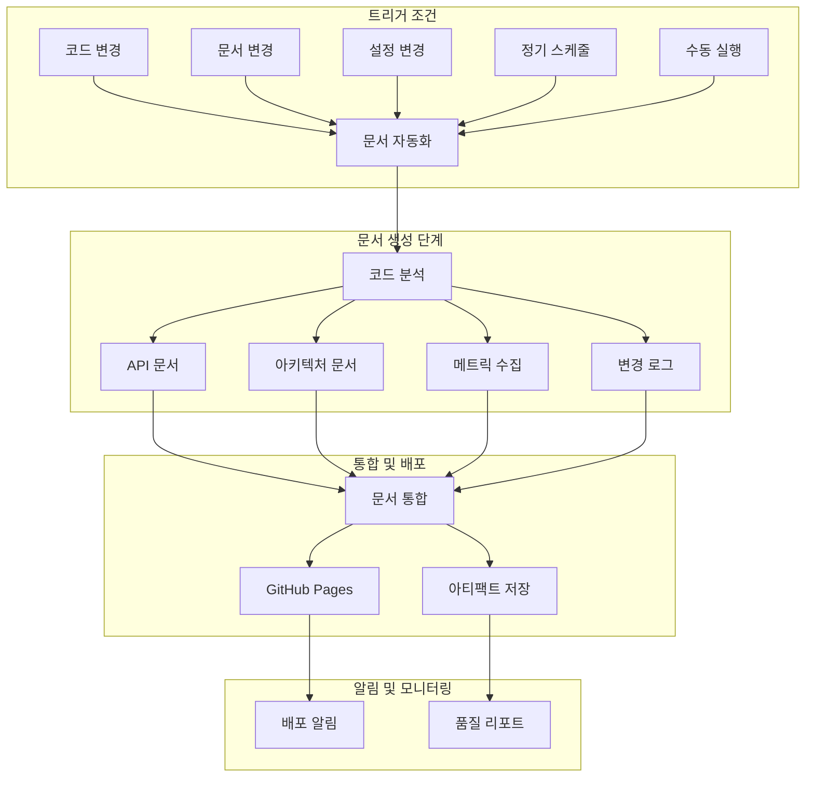

# 📚 CodePing.AI 문서 자동화 가이드

## 📋 개요

CodePing.AI 프로젝트는 코드 변경사항을 기반으로 문서를 자동으로 생성하고 업데이트하는 포괄적인 문서 자동화 시스템을 구축했습니다. 이 시스템은 AI-driven Modular Design 원칙을 따르며, 12개의 PyPI 패키지와 메인 애플리케이션의 문서를 자동으로 관리합니다.

## 🏗️ 문서 자동화 아키텍처

### 🔄 워크플로우 구조



## 📁 문서 자동화 구성요소

### 1. 🔧 워크플로우 파일

#### 메인 문서 자동화 워크플로우 (`.github/workflows/docs.yml`)
- **코드 분석 및 메트릭 수집**: 복잡도, 커버리지, 품질 지표
- **API 문서 생성**: pdoc3, Sphinx 기반 자동 문서화
- **아키텍처 문서**: Mermaid 다이어그램, 의존성 분석
- **변경 로그**: Git 기반 자동 변경 이력 생성
- **문서 통합 및 배포**: GitHub Pages 자동 배포

#### 문서 설정 워크플로우 (`.github/workflows/docs-config.yml`)
- **환경 변수 관리**: 문서 생성 관련 모든 설정
- **재사용 가능한 구성요소**: 다른 워크플로우에서 호출 가능
- **출력 관리**: 문서 URL, 아티팩트 상태 등

### 2. 📊 생성되는 문서 유형

#### 🔧 API 문서
- **PyPI 패키지 API**: 12개 universal 패키지 문서
- **메인 애플리케이션**: shared, infrastructure 모듈
- **Sphinx 문서**: 고급 문서화 기능
- **타입 힌트**: 자동 타입 정보 포함

#### 🏗️ 아키텍처 문서
- **모듈 의존성**: PyPI 패키지 간 관계
- **시스템 아키텍처**: 전체 시스템 구조
- **프로젝트 구조**: 디렉터리 트리 분석

#### 📊 코드 메트릭
- **복잡도 분석**: Cyclomatic complexity, Maintainability index
- **테스트 커버리지**: 라인별, 파일별 커버리지
- **문서 품질**: Docstring 커버리지, 품질 점수

#### 📝 변경 로그
- **자동 변경 이력**: Git 커밋 기반 분류
- **릴리스 노트**: 태그 기반 버전별 정리
- **최근 변경사항**: 7일간 활동 요약

## 🚀 사용 방법

### 자동 실행 조건

1. **코드 푸시**: `main`, `develop` 브랜치에 Python 파일 변경
2. **문서 변경**: Markdown, reStructuredText 파일 수정
3. **설정 변경**: `requirements.txt`, `pyproject.toml` 업데이트
4. **정기 실행**: 매주 일요일 오전 3시 (UTC)
5. **수동 실행**: GitHub Actions 페이지에서 직접 실행

### 수동 실행 방법

```bash
# GitHub CLI 사용
gh workflow run docs.yml --ref main -f doc_type=all

# 특정 문서 유형만 생성
gh workflow run docs.yml --ref main -f doc_type=api
gh workflow run docs.yml --ref main -f doc_type=architecture
gh workflow run docs.yml --ref main -f doc_type=changelog
gh workflow run docs.yml --ref main -f doc_type=coverage
```

### GitHub Actions UI 사용

1. GitHub 저장소 → Actions 탭
2. "📚 Documentation Automation" 워크플로우 선택
3. "Run workflow" 버튼 클릭
4. 문서 유형 선택 후 실행

## 📖 생성된 문서 구조

### GitHub Pages 배포 구조

```
https://[owner].github.io/[repo]/docs/
├── index.html                 # 메인 문서 허브
├── api/                       # API 문서
│   ├── README.md             # API 문서 인덱스
│   ├── universal_data_storage/
│   ├── universal_webhook_receiver/
│   └── ...
├── architecture/             # 아키텍처 문서
│   └── README.md            # 시스템 아키텍처
├── metrics/                  # 코드 메트릭
│   ├── complexity.md        # 복잡도 분석
│   ├── complexity.json      # 원시 데이터
│   └── maintainability.json
├── coverage/                 # 테스트 커버리지
│   ├── README.md           # 커버리지 요약
│   ├── htmlcov/           # HTML 리포트
│   └── coverage.json      # 원시 데이터
├── quality/                 # 문서 품질
│   ├── README.md          # 품질 요약
│   ├── docstring-coverage.svg
│   └── docstring-report.txt
└── changelog/              # 변경 로그
    ├── CHANGELOG.md       # 전체 변경 이력
    └── RECENT.md         # 최근 변경사항
```

## ⚙️ 설정 및 커스터마이징

### 환경 변수 설정

문서 자동화 동작을 커스터마이징하려면 `.github/workflows/docs-config.yml`에서 다음 설정을 수정하세요:

```yaml
env:
  # 📖 문서 생성 설정
  DOC_PYTHON_VERSION: "3.12"
  DOC_OUTPUT_DIR: "docs-site"
  DOC_ARTIFACTS_RETENTION: 30  # days
  
  # 📊 메트릭 설정
  COVERAGE_THRESHOLD: 70      # minimum coverage percentage
  COMPLEXITY_THRESHOLD: 10    # maximum cyclomatic complexity
  DOCSTRING_THRESHOLD: 80     # minimum docstring coverage
  
  # 🏗️ 아키텍처 문서 설정
  ARCHITECTURE_DEPTH: 3       # directory tree depth
  
  # 📝 변경 로그 설정
  CHANGELOG_TAGS_LIMIT: 10    # number of recent tags to include
  CHANGELOG_COMMITS_LIMIT: 100 # number of recent commits to analyze
```

### PyPI 패키지 추가

새로운 universal 패키지를 추가할 때는 `.github/workflows/docs.yml`의 모듈 목록을 업데이트하세요:

```bash
modules=(
  "universal_data_storage"
  "universal_webhook_receiver"
  # ... 기존 모듈들
  "universal_new_module"  # 새 모듈 추가
)
```

### 문서 테마 변경

Sphinx 테마를 변경하려면:

```yaml
# docs-config.yml
env:
  SPHINX_THEME: "sphinx_rtd_theme"  # 다른 테마로 변경 가능
```

지원되는 테마:
- `sphinx_rtd_theme` (기본)
- `alabaster`
- `nature`
- `pyramid`
- `bizstyle`

## 📊 모니터링 및 품질 관리

### 문서 품질 지표

1. **API 문서 커버리지**: 모든 공개 함수/클래스 문서화 비율
2. **Docstring 품질**: Google/NumPy 스타일 준수도
3. **코드 복잡도**: 함수별 순환 복잡도 분석
4. **테스트 커버리지**: 코드 라인 커버리지 70% 이상 유지

### 자동 품질 검사

```python
# 문서 품질 임계값 설정
COVERAGE_THRESHOLD = 70     # 최소 테스트 커버리지
COMPLEXITY_THRESHOLD = 10   # 최대 순환 복잡도
DOCSTRING_THRESHOLD = 80    # 최소 docstring 커버리지
```

### 품질 개선 가이드

#### 낮은 테스트 커버리지 해결
```bash
# 커버리지가 낮은 파일 식별
pytest --cov=. --cov-report=term-missing

# 특정 모듈 테스트 추가
pytest tests/modules/[module_name]/
```

#### 높은 코드 복잡도 해결
```bash
# 복잡도 분석
radon cc . --show-complexity --min=B

# 복잡한 함수 리팩토링 권장사항:
# - 함수 분할
# - 조건문 단순화
# - 중첩 루프 제거
```

#### Docstring 품질 개선
```python
def example_function(param1: str, param2: int) -> bool:
    """
    함수의 목적을 명확히 설명합니다.
    
    Args:
        param1: 첫 번째 매개변수 설명
        param2: 두 번째 매개변수 설명
        
    Returns:
        반환값에 대한 설명
        
    Raises:
        ValueError: 예외 발생 조건 설명
        
    Example:
        >>> example_function("test", 42)
        True
    """
    pass
```

## 🔧 트러블슈팅

### 일반적인 문제 해결

#### 1. 문서 생성 실패

**증상**: 워크플로우가 실패하거나 문서가 생성되지 않음

**해결방법**:
```bash
# 로컬에서 문서 생성 테스트
pip install pdoc3 sphinx sphinx-rtd-theme
pdoc3 --html --output-dir test-docs shared/

# 의존성 확인
pip install -r requirements.txt
python -c "import shared.config.settings"
```

#### 2. PyPI 패키지 import 실패

**증상**: API 문서에서 "Module not available" 메시지

**해결방법**:
```bash
# 패키지 설치 확인
pip list | grep universal_

# 패키지 import 테스트
python -c "import universal_data_storage"

# 패키지 재설치
pip install --upgrade universal-data-storage
```

#### 3. GitHub Pages 배포 실패

**증상**: 문서가 생성되지만 웹사이트에 반영되지 않음

**해결방법**:
1. GitHub 저장소 → Settings → Pages
2. Source를 "GitHub Actions"로 설정
3. `GITHUB_TOKEN` 권한 확인

#### 4. 메트릭 수집 오류

**증상**: 코드 복잡도나 커버리지 데이터가 누락됨

**해결방법**:
```bash
# 도구 설치 확인
pip install radon coverage pytest-cov interrogate

# 수동 실행 테스트
radon cc . --json
coverage run -m pytest tests/
interrogate . --verbose
```

### 성능 최적화

#### 빌드 시간 단축

1. **캐시 활용**: 의존성 캐시 최적화
2. **병렬 실행**: 독립적인 작업 병렬화
3. **조건부 실행**: 변경된 파일만 처리

```yaml
# 캐시 설정 예시
- name: Cache Python dependencies
  uses: actions/cache@v3
  with:
    path: ~/.cache/pip
    key: ${{ runner.os }}-pip-${{ hashFiles('**/requirements.txt') }}
```

#### 리소스 사용량 최적화

```yaml
# 리소스 제한 설정
jobs:
  documentation:
    runs-on: ubuntu-latest
    timeout-minutes: 30  # 최대 실행 시간 제한
```

## 🔄 CI/CD 통합

### 메인 CI 파이프라인과의 연동

문서 자동화는 메인 CI 파이프라인과 완전히 통합되어 있습니다:

1. **CI 성공 시**: 자동으로 문서 업데이트 트리거
2. **변경 감지**: 코드, 문서, 설정 파일 변경 시 실행
3. **실패 허용**: 문서 생성 실패가 CI 전체를 중단시키지 않음

### 다른 워크플로우에서 호출

```yaml
# 다른 워크플로우에서 문서 자동화 호출
jobs:
  call-docs:
    uses: ./.github/workflows/docs-config.yml
    with:
      doc_type: "api"
      force_rebuild: true
```

## 📱 알림 및 모니터링

### Slack 알림 설정

```yaml
# Secrets 설정 필요
SLACK_WEBHOOK_URL: ${{ secrets.SLACK_WEBHOOK_URL }}
```

### 메트릭 모니터링

- **문서 생성 빈도**: 일일/주간 업데이트 추적
- **품질 지표 변화**: 커버리지, 복잡도 트렌드
- **사용자 접근**: GitHub Pages 방문 통계

## 🚀 향후 개선 계획

### 단기 계획 (1-2개월)
- **검색 기능**: 문서 내 전문 검색
- **버전 관리**: 문서 버전별 아카이브
- **다국어 지원**: 영어 문서 자동 생성

### 중기 계획 (3-6개월)
- **AI 기반 문서 생성**: GPT를 활용한 자동 설명 생성
- **인터랙티브 다이어그램**: 클릭 가능한 아키텍처 다이어그램
- **문서 품질 AI 리뷰**: 자동 문서 품질 평가

### 장기 계획 (6개월+)
- **실시간 문서 업데이트**: 코드 변경 시 즉시 반영
- **문서 분석 대시보드**: 종합적인 문서 품질 모니터링
- **자동 튜토리얼 생성**: 코드 예제 기반 튜토리얼 자동 생성

## 📚 참고 자료

### 도구 문서
- [pdoc3 Documentation](https://pdoc3.github.io/pdoc/)
- [Sphinx Documentation](https://www.sphinx-doc.org/)
- [Mermaid Diagrams](https://mermaid-js.github.io/mermaid/)
- [GitHub Pages](https://docs.github.com/en/pages)

### 코드 품질 도구
- [Radon](https://radon.readthedocs.io/) - 복잡도 분석
- [Coverage.py](https://coverage.readthedocs.io/) - 테스트 커버리지
- [Interrogate](https://interrogate.readthedocs.io/) - Docstring 커버리지

### 모범 사례
- [Google Python Style Guide](https://google.github.io/styleguide/pyguide.html)
- [NumPy Docstring Guide](https://numpydoc.readthedocs.io/en/latest/format.html)
- [Keep a Changelog](https://keepachangelog.com/)

---

이 문서 자동화 시스템은 CodePing.AI의 AI-driven Modular Design 원칙을 완벽하게 지원하며, 12개 PyPI 패키지와 메인 애플리케이션의 문서를 자동으로 최신 상태로 유지합니다. 추가 질문이나 개선 제안이 있으시면 이슈를 생성해 주세요.