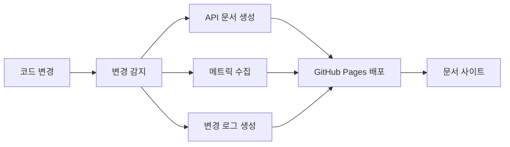

# 📚 간단한 문서 자동화 가이드

## 📋 개요

CodePing.AI의 문서 자동화는 메인 CI/CD 파이프라인에 통합되어 있습니다. 코드 변경 시 자동으로 문서를 생성하고 GitHub Pages에 배포합니다.

## 🏗️ 아키텍처



## 🚀 사용 방법

### 자동 실행
문서는 다음 상황에서 자동으로 업데이트됩니다:

```bash
# main 브랜치에 Python 또는 Markdown 파일 변경 시
git add .
git commit -m "feat: add new feature"
git push origin main
```

### 수동 실행
GitHub Actions에서 "🚀 CodePing.AI CI/CD" 워크플로우를 수동 실행할 수 있습니다.

## 📖 생성되는 문서

### 📚 문서 사이트 구조
```
https://[username].github.io/[repository]/docs/
├── index.html          # 📚 메인 허브
├── api/                # 🔧 API 문서
│   ├── shared/
│   └── infrastructure/
├── metrics/            # 📊 코드 메트릭
└── changelog/          # 📝 변경 로그
```

### 🔧 API 문서
- **shared 모듈**: 공통 설정, 유틸리티, 인터페이스
- **infrastructure 모듈**: AWS, GitHub, OpenAI, Slack 클라이언트

### 📊 코드 메트릭
- **테스트 커버리지**: pytest-cov 기반
- **코드 복잡도**: radon 기반 순환 복잡도 분석

### 📝 변경 로그
- **최근 10개 커밋**: Git 로그 기반 자동 생성

## ⚙️ 설정

### 문서 업데이트 조건
```yaml
# 다음 파일 변경 시 문서 업데이트
paths: ['**/*.py', '**/*.md']
```

### 생성 도구
- **pdoc3**: API 문서 생성
- **pytest-cov**: 테스트 커버리지
- **radon**: 코드 복잡도 분석

## 🔧 커스터마이징

### 새 모듈 추가
`shared`나 `infrastructure` 디렉터리에 새 모듈을 추가하면 자동으로 문서에 포함됩니다.

### 문서 스타일 변경
`main.yml`의 HTML 템플릿을 수정하여 문서 사이트 스타일을 변경할 수 있습니다.

## 🐛 트러블슈팅

### 문서 생성 실패
```bash
# 로컬에서 테스트
pip install pdoc3 radon pytest-cov
pdoc3 --html --output-dir test-docs shared
```

### GitHub Pages 배포 실패
- GitHub 저장소 설정에서 Pages 설정 확인
- `gh-pages` 브랜치 권한 확인

## 📈 성능 최적화

### 조건부 생성
- 코드나 문서 파일이 변경된 경우에만 문서 재생성
- 변경 감지를 통한 불필요한 작업 방지

### 캐시 활용
- pip 의존성 캐시로 빌드 시간 단축

## 🔮 향후 계획

### 단기
- 검색 기능 추가
- 더 상세한 API 문서

### 중기
- 인터랙티브 다이어그램
- 다국어 지원

### 장기
- AI 기반 문서 생성
- 실시간 업데이트

---

> 💡 **팁**: 문서는 코드 변경과 함께 자동으로 업데이트되므로, 별도 관리가 필요하지 않습니다.