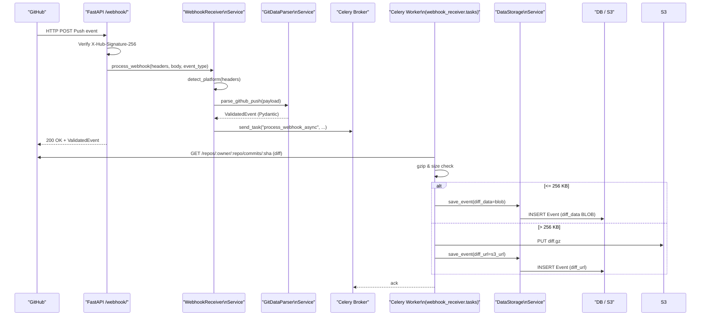

# WebhookReceiver 기술 명세서 (Phase 1: GitHub Push 전용)

## 1. 개요
GitHub **Push** 이벤트를 받아 _원본 Webhook JSON 전체_ 와 주요 메타데이터를 SSOT(DB/S3)에 저장한다. HTTP 응답은 200 ms 내로 반환하기 위해 Celery 기반 비동기 파이프라인을 사용한다.

**새로운 모듈형 모놀리스 구조**로 설계되어 향후 마이크로서비스 분리를 준비하고 있다.

## 2. 모듈 구성 (신규 구조)
| 경로 | 역할 |
|------|------|
| `modules/webhook_receiver/router.py` | FastAPI 엔드포인트 / 서명 검증 / Celery 큐잉 |
| `modules/webhook_receiver/service.py` | 플랫폼 판별·프로세서 라우팅 |
| `modules/git_data_parser/service.py` | GitHub Push 파싱 → `ValidatedEvent` 생성 |
| `modules/webhook_receiver/tasks.py` | Celery 태스크 – diff 수집·압축·저장 |
| `modules/data_storage/models.py` | ORM(Event) – SSOT 스키마 정의 |
| `shared/config/celery_app.py` | Celery 인스턴스·브로커 설정 |
| `shared/config/settings.py` | 환경변수 및 설정 관리 |
| `shared/config/database.py` | 데이터베이스 연결 관리 |

## 3. 요청-응답 흐름


## 4. 인터페이스 정의
| 항목 | 내용 |
|------|------|
| HTTP | `POST /webhook/` |
| 필수 헤더 | `X-Hub-Signature-256`, `X-GitHub-Event: push`, `Content-Type: application/json` |
| Body | GitHub Push 이벤트 원본 JSON |
| 응답 (200) | `ValidatedEvent` – repo, ref, pusher, commits, timestamp 등 |
| 오류 코드 | 401 서명 실패, 400 잘못된 JSON, 501 비지원 플랫폼 |

## 5. 내부 로직 요약
1. **서명 검증** → HMAC-SHA256 비교 (`modules/webhook_receiver/router.py`)
2. **플랫폼 판별** → `WebhookService.process_webhook()` 
3. **Processor 실행** → GitDataParserService가 `ValidatedEvent` 리턴
4. **비동기 Off-load** → `celery_app.send_task("process_webhook_async", …)`
5. **Celery 태스크** → diff 다운로드·압축·DB/S3 저장
6. **로깅** → 모듈별 독립적인 `logging` 사용

## 6. 데이터 모델 (`Event` - 신규 구조)
| 컬럼 | 타입 | 설명 |
|------|------|------|
| `payload` | JSON | 원본 Webhook 전체 |
| `diff_data` | BLOB | gzip(≤ 256 KB) |
| `diff_url` | VARCHAR | S3 경로(> 256 KB) |
| `added_lines / deleted_lines / files_changed` | INT | diff 통계 |
| `repository / commit_sha` | INDEX | 조회·중복 방지 (UNIQUE 제약) |
| 기타 | event_type, author_name, author_email, created_at |

**중복 방지**: `(repository, commit_sha)` UNIQUE 제약으로 동일 커밋 재처리 방지

## 7. 환경 변수
| 변수 | 설명 |
|------|------|
| `GITHUB_WEBHOOK_SECRET` | HMAC 검증 키 |
| `DATABASE_URL` | SQLAlchemy URL (기본: sqlite+aiosqlite:///./dev.db) |
| `CELERY_BROKER_URL` | Redis/RabbitMQ 등 브로커 |
| `CELERY_ALWAYS_EAGER` | 로컬 동기 실행 플래그 (기본: true) |
| `AWS_ACCESS_KEY_ID / AWS_SECRET_ACCESS_KEY / AWS_S3_BUCKET` | diff S3 업로드 |
| `GITHUB_TOKEN` | GitHub Commit API 호출 인증(선택) |

## 8. 예외 처리 & 보안
* 서명 불일치 → 401 Unauthorized
* JSON 파싱 오류 → 400 Bad Request  
* 플랫폼 미지원 → 501 Not Implemented
* Celery 태스크 실패 → 자동 재시도(back-off)
* 외부 호출 `timeout=20s` 및 예외 로깅
* S3 업로드 ACL = private
* **대소문자 무관 헤더 처리**: X-GitHub-Event, x-github-event 모두 지원

## 9. 성능·확장성
* HTTP 레이어 p99 < 200 ms (검증·큐잉만 수행)
* 워커 수평 확장으로 TPS 선형 확장
* diff > 256 KB → S3 off-load 로 DB 용량 관리
* **모듈형 구조**: 각 모듈을 독립적인 마이크로서비스로 분리 가능
* 자동 라우터 발견: `modules/` 하위 폴더에서 `router.py` 자동 로드

## 10. 테스트 전략
| 구분 | 파일/절차 | 검증 내용 |
|------|-----------|-----------|
| 단위 | `tests/modules/webhook_receiver/test_webhook_receiver.py` | 서명 OK/NG, 응답 스키마, JSON 오류 처리 |
| 통합 | `tests/modules/webhook_receiver/test_integration.py` | 실제 GitHub 페이로드 처리 |
| E2E | 로컬 테스트 가이드 | Webhook → Celery → DB/S3 전 과정 |

**테스트 실행**:
```bash
# WebhookReceiver 모듈만
$ python -m pytest tests/modules/webhook_receiver/ -v

# 전체 모듈 테스트  
$ python -m pytest tests/modules/ -v
```

## 11. 모듈형 아키텍처 특징

### 11-1. 재사용성 중심 설계
- 각 모듈은 **단일 책임 원칙** 준수
- **인터페이스 기반** 모듈 간 통신
- 다른 프로젝트에서 **독립적으로 사용 가능**

### 11-2. 확장성
```
modules/
├── webhook_receiver/    # 현재 구현됨
├── git_data_parser/     # 현재 구현됨  
├── data_storage/        # 현재 구현됨
├── diff_analyzer/       # 향후 추가
├── schedule_manager/    # 향후 추가 (08:00 KST 스케줄러)
├── slack_notifier/      # 향후 추가
└── activity_analyzer/   # 향후 추가
```

### 11-3. 마이크로서비스 준비
- 각 모듈은 독립적인 **Docker 컨테이너**로 배포 가능
- **shared/** 영역을 통한 공통 설정 관리
- **infrastructure/** 영역을 통한 외부 서비스 추상화

## 12. 향후 로드맵
1. **Phase 2**: 
   - GitLab·Bitbucket Processor 추가 (PlatformRouter 확장)
   - SlackNotifier & DailySummaryScheduler (08:00 KST)
   - `schedule_manager` 모듈 구현
2. **Phase 3**:
   - Alembic 마이그레이션 자동화
   - OpenTelemetry tracing, Flower 대시보드 연동
   - 모듈별 마이크로서비스 분리

## 13. 메모리 기반 요구사항 반영
- **Daily summary**: 매일 08:00 Asia/Seoul 시간대에 Slack 알림 전송
- **Diff 저장 정책**: gzip ≤256KB는 DB 저장, 초과 시 S3 업로드 후 URL 저장  
- **중복 방지**: (repository, commit_sha) 조합으로 UNIQUE 제약
- **SSOT**: Complete Webhook Data 원본 JSON 보존 