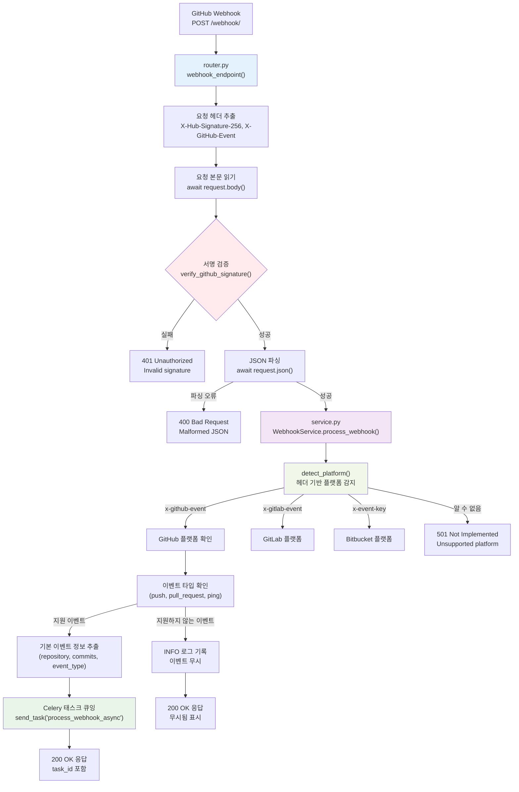
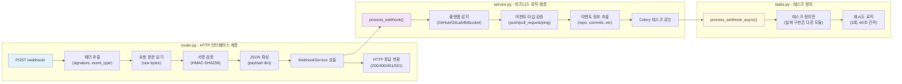
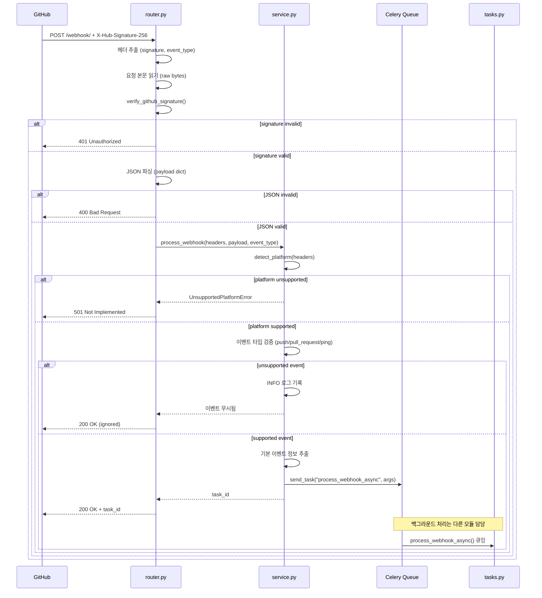

# WebhookReceiver 모듈 기술 명세서

## 1. 개요
WebhookReceiver 모듈은 GitHub Webhook 이벤트를 수신하고 검증하여 비동기 처리를 위해 Celery 큐에 전달하는 역할을 담당합니다. HTTP 응답 시간을 200ms 이내로 유지하기 위해 최소한의 검증만 수행하고 실제 데이터 처리는 백그라운드로 위임합니다.

## 2. 모듈 구조
```
modules/webhook_receiver/
├── __init__.py           # 모듈 초기화
├── router.py            # FastAPI 라우터 및 엔드포인트
├── service.py           # 비즈니스 로직 (플랫폼 감지, 라우팅)
└── tasks.py             # Celery 비동기 태스크
```

## 3. 핵심 책임
### 3-1. HTTP 엔드포인트 제공 (`router.py`)
- `POST /webhook/` 엔드포인트 처리
- GitHub 서명 검증 (X-Hub-Signature-256)
- 요청 헤더 및 페이로드 파싱
- 빠른 HTTP 응답 (200ms 이내)

### 3-2. 플랫폼 감지 및 라우팅 (`service.py`)
- 요청 헤더 기반 플랫폼 감지 (GitHub/GitLab/Bitbucket)
- 이벤트 타입 확인 (push/pull_request 등)
- 적절한 프로세서로 라우팅

### 3-3. 비동기 처리 큐잉 (`tasks.py`)
- Celery 태스크로 백그라운드 처리 위임
- 실패 시 재시도 로직
- 태스크 상태 모니터링

## 4. 모듈 내부 흐름 시각화

### 4-1. WebhookReceiver 모듈 내부 흐름


### 4-2. WebhookReceiver 파일별 책임 분담


### 4-3. WebhookReceiver 시퀀스 다이어그램


### 4-4. WebhookReceiver 모듈 특성
**단일 책임 원칙**:
- HTTP 요청 수신 및 검증에만 집중
- 실제 데이터 처리는 다른 모듈에 위임
- 200ms 이내 빠른 응답으로 GitHub 타임아웃 방지

**견고한 입력 검증**:
- HMAC-SHA256 서명 검증으로 보안 확보
- 플랫폼별 헤더 패턴 감지
- JSON 파싱 오류 및 잘못된 이벤트 타입 처리

**확장 가능한 설계**:
- 새로운 플랫폼 추가 시 `detect_platform()` 함수만 수정
- 이벤트 타입별 필터링으로 불필요한 처리 방지
- Celery 큐를 통한 백프레셰 분리

## 5. API 인터페이스

### 5-1. Webhook 엔드포인트
```http
POST /webhook/
Content-Type: application/json
X-Hub-Signature-256: sha256=<signature>
X-GitHub-Event: push

{
  "ref": "refs/heads/main",
  "repository": {...},
  "commits": [...],
  ...
}
```

### 5-2. 응답 형식
**성공 (200 OK)**:
```json
{
  "status": "accepted",
  "event_type": "push",
  "repository": "owner/repo",
  "commits_count": 3,
  "task_id": "celery-task-uuid"
}
```

**오류 응답**:
- `400 Bad Request`: JSON 파싱 오류
- `401 Unauthorized`: 서명 검증 실패
- `501 Not Implemented`: 지원하지 않는 플랫폼/이벤트

## 6. 서명 검증

### 6-1. GitHub HMAC-SHA256 검증
```python
def verify_github_signature(payload: bytes, signature: str, secret: str) -> bool:
    expected = hmac.new(
        secret.encode(),
        payload,
        hashlib.sha256
    ).hexdigest()
    return hmac.compare_digest(f"sha256={expected}", signature)
```

### 6-2. 보안 고려사항
- 타이밍 공격 방지 (`hmac.compare_digest` 사용)
- 서명 헤더 대소문자 무관 처리
- 빈 페이로드 및 잘못된 인코딩 처리

## 7. 플랫폼 감지 로직

### 7-1. 헤더 기반 플랫폼 식별
```python
def detect_platform(headers: dict) -> str:
    headers_lower = {k.lower(): v for k, v in headers.items()}
    
    if 'x-github-event' in headers_lower:
        return 'github'
    elif 'x-gitlab-event' in headers_lower:
        return 'gitlab'
    elif 'x-event-key' in headers_lower:
        return 'bitbucket'
    else:
        raise UnsupportedPlatformError("Unknown webhook platform")
```

### 7-2. 이벤트 타입 필터링
- **지원 이벤트**: push, pull_request, ping
- **무시 이벤트**: star, fork, watch 등
- **오류 처리**: 알 수 없는 이벤트는 로그만 기록

## 8. Celery 통합

### 8-1. 태스크 정의 (`tasks.py`)
```python
@celery_app.task(
    bind=True,
    autoretry_for=(Exception,),
    retry_kwargs={'max_retries': 3, 'countdown': 60}
)
def process_webhook_async(self, platform: str, event_type: str, payload: dict):
    """비동기 Webhook 처리"""
    try:
        # 실제 데이터 파싱 및 저장 로직 호출
        return {"status": "completed"}
    except Exception as exc:
        self.retry(exc=exc)
```

### 8-2. 큐 설정
- **큐 이름**: `webhook_queue`
- **우선순위**: push > pull_request > ping
- **동시 실행**: worker당 4개 태스크
- **타임아웃**: 300초

## 9. 설정 및 환경변수

### 9-1. 필수 환경변수
```bash
# GitHub Webhook 서명 검증
GITHUB_WEBHOOK_SECRET=your_webhook_secret

# Celery 브로커 설정
CELERY_BROKER_URL=redis://localhost:6379/0
CELERY_RESULT_BACKEND=redis://localhost:6379/0

# 개발/테스트 모드
CELERY_ALWAYS_EAGER=true  # 동기 실행 (테스트용)
```

### 9-2. 선택적 설정
```bash
# 로깅 레벨
LOG_LEVEL=INFO

# 헬스체크 설정
HEALTH_CHECK_ENABLED=true
```

## 10. 에러 처리 및 로깅

### 10-1. 예외 계층
```python
class WebhookReceiverError(Exception):
    """WebhookReceiver 모듈 기본 예외"""

class InvalidSignatureError(WebhookReceiverError):
    """서명 검증 실패"""

class UnsupportedPlatformError(WebhookReceiverError):
    """지원하지 않는 플랫폼"""

class PayloadParsingError(WebhookReceiverError):
    """페이로드 파싱 오류"""
```

### 10-2. 로깅 정책
- **INFO**: 정상 요청 처리
- **WARNING**: 지원하지 않는 이벤트
- **ERROR**: 서명 실패, 파싱 오류
- **DEBUG**: 상세 페이로드 정보 (개발 모드만)

## 11. 성능 및 모니터링

### 11-1. 성능 지표
- **응답 시간**: p99 < 200ms
- **처리량**: 초당 100 요청 처리 가능
- **메모리 사용량**: 요청당 < 10MB

### 11-2. 헬스체크
```http
GET /health
```
응답:
```json
{
  "status": "healthy",
  "module": "webhook_receiver",
  "celery_broker": "connected",
  "timestamp": "2024-01-01T00:00:00Z"
}
```

## 12. 테스트

### 12-1. 단위 테스트
```bash
# WebhookReceiver 모듈 테스트만 실행
python -m pytest tests/modules/webhook_receiver/test_webhook_receiver.py -v
```

**테스트 케이스**:
- 유효한 GitHub 서명 검증
- 잘못된 서명 거부
- JSON 파싱 오류 처리
- 지원하지 않는 이벤트 처리
- 헬스체크 엔드포인트

### 12-2. 통합 테스트
```bash
# 실제 GitHub 페이로드로 통합 테스트
python -m pytest tests/modules/webhook_receiver/test_integration.py -v
```

**테스트 케이스**:
- 실제 GitHub Push 페이로드 처리
- Force Push 이벤트 처리
- Ping 이벤트 처리
- 대용량 페이로드 처리

## 13. 배포 고려사항

### 13-1. Docker 설정
```dockerfile
# WebhookReceiver 모듈 전용 컨테이너
FROM python:3.12-slim
COPY modules/webhook_receiver /app/modules/webhook_receiver
COPY shared /app/shared
```

### 13-2. 수평 확장
- Stateless 설계로 인스턴스 자유롭게 확장 가능
- 로드 밸런서를 통한 트래픽 분산
- Celery worker 별도 확장 가능

### 13-3. 모니터링
- Prometheus 메트릭 수집
- Grafana 대시보드
- Sentry 오류 추적

## 14. 향후 개선사항

### 14-1. 단기 계획
- GitLab, Bitbucket 지원 추가
- Webhook 재전송 메커니즘 구현
- 상세한 메트릭 수집

### 14-2. 장기 계획
- OpenTelemetry 분산 추적
- gRPC 인터페이스 추가
- 마이크로서비스 분리 